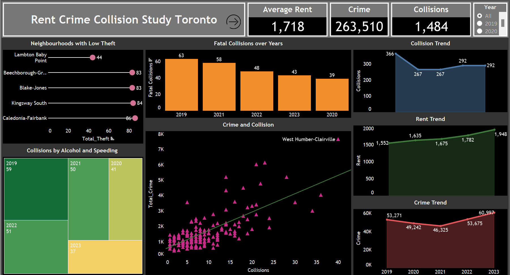
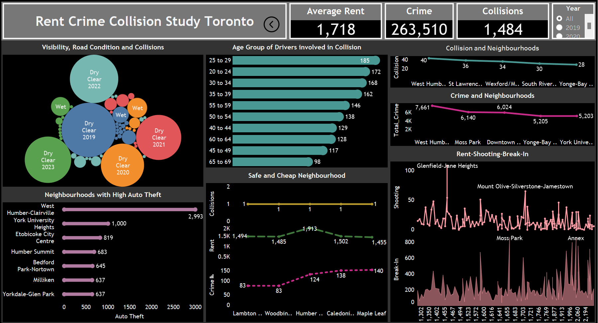

<h1 align="center">Crime Collision Rent Study-Toronto</h1>

  

## Table of Contents
1. [Project Overview](#project-overview)
2. [Project Scope](#project-scope)
3. [Data Sources](#data-sources)
4. [Folder Structure](#folder-structure)
5. [Data Cleaning and EDA](#data-cleaning-and-eda)
6. [Visualizations](#visualizations)
7. [Conclusion](#conclusion)
8. [Author](#author)
9. [Dependencies](#dependencies)

## Project Overview
This project explores and analyzes data related to crime rates, motor vehicle collisions, and rental prices across Toronto neighbourhoods. It aims to uncover trends, relationships, and insights that can inform urban planning and policy decisions.

## Project Scope
The objective of this project is to:
- Analyze trends in motor vehicle collisions and crime rates.
- Investigate the relationship between rental prices and crime rates.
- Identify key neighbourhoods with significant crime, collisions, and rental price trends.

## Data Sources
- **Motor Vehicle Collisions**: Toronto Police Service dataset
- **Neighbourhood Crime**: City of Toronto Open Data
- **Rental Data**: Canada Mortgage and Housing Corporation (CMHC)

## Folder Structure
The project follows the Cookiecutter Data Science structure and includes the following folders:

- **`data/`**: Contains raw and processed data files.
  - `raw/` - Original datasets
  - `processed/` - Cleaned datasets for analysis
  
- **`src/`**: Contains SQL queries used for data cleaning and exploratory data analysis (EDA).
  - `cleaning/` - SQL queries for data cleaning
  - `eda/` - SQL queries for exploratory data analysis
  
- **`reports/`**: Contains project reports and visualizations.
  - `figures/` - PNG photos of the Tableau dashboards
  - `videos/` - Videos demonstrating the Tableau dashboards
  - `tableau/` - Contains tableau worksheets and dashboards.

- **`README.md`**: This file.

## Data Cleaning and EDA
Data cleaning and exploratory data analysis were performed using SQL.

## Visualizations
Dashboards and visualizations were created using Tableau. The following assets are included:

- **Figures Folder**: PNG images of the Tableau dashboards.
  - **Dashboard Overview:**
  - **Dashboard Overview:**

- **Videos Folder**: Videos demonstrating the Tableau dashboards.
  - **Dashboard Demo:**

https://github.com/user-attachments/assets/03c3ecfd-ae5f-4588-8e49-de7ed5aef08e
## Conclusion
The analysis provides valuable insights into crime trends, rental prices, and traffic collisions in Toronto. By integrating and visualizing these datasets, the project highlights key patterns and trends that can inform urban planning, safety measures, and policy decisions. The interactive dashboards offer a user-friendly interface for exploring the data and making data-driven decisions.

## Author
Nikhil Sreenivasan

## Dependencies
- **MySQL**: For data cleaning and EDA.
- **Tableau**: For data visualization.
